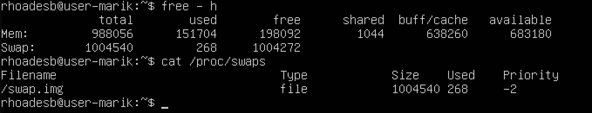

## Part 1. Установка ОС

**== Задание ==**

Установить Ubuntu 20.04 Server LTS без графического интерфейса. (Используем программу для виртуализации - VirtualBox)

- Графический интерфейс должен отсутствовать.

- Узнайте версию Ubuntu, выполнив команду 
`cat /etc/issue`.

- Вставьте скриншот с выводом команды.

**== Выполнение ==**

##### Установка Ubuntu 20.04 Server. Выполнение команды `cat /etc/issue`

## Part 2. Создание пользователя

**== Задание ==**

Создать пользователя, отличного от пользователя, который создавался при установке. Пользователь должен быть добавлен в группу adm.

Вставьте скриншот вызова команды для создания пользователя.
Новый пользователь должен быть в выводе команды 
cat /etc/passwd

Вставьте скриншот с выводом команды.

**== Выполнение ==**

##### Добавление нового пользователя с именем `marik123` и выдачей этому пользователю прав `adm`

- Ввод команды `cat etc/passwd`. Последние 3 строчки показывают наличие нового пользователя с ником `marik123`

## Part 3. Настройка сети ОС

**== Задание ==**

Задать название машины вида user-1

Установить временную зону, соответствующую вашему текущему местоположению.

Вывести названия сетевых интерфейсов с помощью консольной команды.

- В отчёте дать объяснение наличию интерфейса lo.

Используя консольную команду получить ip адрес устройства, на котором вы работаете, от DHCP сервера.

- В отчёте дать расшифровку DHCP.

Определить и вывести на экран внешний ip-адрес шлюза (ip) и внутренний IP-адрес шлюза, он же ip-адрес по умолчанию (gw).

Задать статичные (заданные вручную, а не полученные от DHCP сервера) настройки ip, gw, dns (использовать публичный DNS серверы, например 1.1.1.1 или 8.8.8.8).

Перезагрузить виртуальную машину. Убедиться, что статичные сетевые настройки (ip, gw, dns) соответствуют заданным в предыдущем пункте.

- В отчёте опишите, что сделали для выполнения всех семи пунктов (можно как текстом, так и скриншотами).
- Успешно пропинговать удаленные хосты 1.1.1.1 и ya.ru и вставить в отчёт скрин с выводом команды. В выводе команды должна быть фраза "0% packet loss".

**== Выполнение ==**

##### Ввод команды `sudo hostname` для проверки нынешнего имени хоста. Ввод команды `sudo hostnamectl set-hostname user-1` для изменения имени хоста по заданию.

##### Ввод команды `timedatectl` для проверки нынешней временной зоны. Ввод команды `sudo timedarecrl set-timezone Europe/Moscow` для установки системного времени по МСК.

##### Ввод команды `ip -br link show` для вывода сетевых интерфейсов в компактном виде. Аналогичная команда `ip addr` показывает сетевые интерфейсы в развернутом виде.  

При выводе команды видно наличие интерфейса lo

_lo (интерфейс loopback) — виртуальный интерфейс, который по умолчанию присутствует в любом Linux. Он используется сетевым клиентским программным обеспечением, чтобы общаться с серверным приложением, расположенным на том же компьютере. Наиболее широко используемый IP адрес в механизмах loopback — 127.0.0.1._

##### Ввод команды `cat /var/log/syslog | grep -i 'dhcp'` выводит ip-адрес, полученный от DHCP-сервера

- DHCP (англ. Dynamic Host Configuration Protocol — протокол динамической настройки узла) — сетевой протокол, позволяющий сетевым устройствам автоматически получать IP-адрес и другие параметры, необходимые для работы в сети TCP/IP.

##### Ввод команды `curl icanhazip.com` выводит внешний ip-адресс шлюза

##### Ввод команды `ip route | grep default` выводит внутренний ip-адресс шлюза

##### Необходимо задать статичные настройки ip, gw, dns.
- Необходимо проверить, отключена ли облачная инициализация. Если при использовании команды `cat /etc/cloud/cloud.cfg.d/subiquity-disable-cloudinit-networking.cfg` в консоли выведется `network: {config: enabled}`, то необходимо будет открыть текстовый редактор этого файла, к примеру, через NANO и прописать `disabled`. 

- В данном случае облачная инициализация отключена.

- Необходимо задать статический ip-адресс в сетевом интерфейсе через текстовый редактор NANO с помощью команды `sudo nano /etc/netplan/00-installer-config.yaml`. На экране будет следующее:

- Установим значение dhcp4 на `no`, чтобы отключить протокол DHCP, а также вручную зададим настройки ip, gw, dns

- Сохранение изменения производится по команде `sudo netplan apply`

- Далее необходимо проверить настройки статического ip-адресса

- Необходимо перезапустить виртуальную машину и проверить не-изменение файла с найстроками

##### Необходимо пропинговать удаленные хосты 1.1.1.1 and ya.ru

## Part 4

**== Задание ==**

- Обновить системные пакеты до последней на момент выполнения задания версии.

- После обновления системных пакетов, если ввести команду обновления повторно, должно появится сообщение, что обновления отсутствуют.

**== Выполнение ==**

- Для обновления системынх пакетов используем команды _update_ для синхронизации индекса пакетов из репозиториев и _upgrade_  для установки самых новых версий пакетов, установленных в системе

- Проверим, что система была обновлена, повторно введя `sudo apt-get upgrade` и получив сообщение об обновлении 0 пакетов

## Part 5

**== Задание ==**

Разрешить пользователю, созданному в Part 2, выполнять команду sudo.

- В отчёте объяснить истинное назначение команды sudo.
- Поменять hostname ОС от имени пользователя, созданного в пункте Part 2 (используя sudo).

**== Выполнение ==**

- Добавим пользователя _school21_user_ в группу _sudo_

- Сменим пользователя на schol21_user с помощью команды su, введя пароль, заданный в Part 2 при создании пользователя

- Поменяем _hostmame_ от лица пользователя _school21_user_

## Part 6. Установка и настройка службы времени

**== Задание ==**

- Настроить службу автоматической синхронизации времени.
- Вывести время, часового пояса, в котором вы сейчас находитесь.
- Вывод следующей команды должен содержать NTPSynchronized=yes: 
timedatectl show

**== Выполнение ==**

## Part 7. Установка и использование текстовых редакторов

**Установить текстовые редакторы VIM (+ любые два по желанию NANO, MCEDIT, JOE и т.д.)**

**Используя каждый из трех выбранных редакторов, создайте файл test_X.txt, где X -- название редактора, в котором создан файл. Напишите в нём свой никнейм, закройте файл с сохранением изменений.**

- В отчёт вставьте скриншоты:
    - Из каждого редактора с содержимым файла перед закрытием.
- В отчёте укажите, что сделали для выхода с сохранением изменений.

**Используя каждый из трех выбранных редакторов, откройте файл на редактирование, отредактируйте файл, заменив никнейм на строку "21 School 21", закройте файл без сохранения изменений.**

- В отчёт вставьте скриншоты:
    -  Из каждого редактора с содержимым файла после редактирования.
- В отчёте укажите, что сделали для выхода без сохранения изменений.

**Используя каждый из трех выбранных редакторов, отредактируйте файл ещё раз (по аналогии с предыдущим пунктом), а затем освойте функции поиска по содержимому файла (слово) и замены слова на любое другое.**

- В отчёт вставьте скриншоты:
    - Из каждого редактора с результатами поиска слова.
- Из каждого редактора с командами, введёнными для замены слова на другое.

**== Выполнение ==**

- Необходимо установить третий текстовый редактор _JOE_ с помощью команды `sudo apt install joe`

- Далее необходимо создать файлы с помощью следующих текстовых редакторов:
    - Vim
    - NANO
    - JOE
    

---

---

---

- Далее необходимо изменить файлы с помощью этих же текстовых редакторов и выйти из их интерфейса без сохранения изменений

---

- Поиск по содержимому файла (слово) на трёх текстовых редакторах проходит по следующим алгоритмам:

---

---

---

- Замена слова на любое другое на трёх текстовых редакторах проходит по следующим алгоритмам:

---

---

---

## Part 8. Установка и базовая настройка сервиса SSHD

**== Задание ==**

**Установить службу SSHd.**

**Добавить автостарт службы при загрузке системы.**

**Перенастроить службу SSHd на порт 2022.**

**Используя команду ps, показать наличие процесса sshd. Для этого к команде нужно подобрать ключи.**

- В отчёте объяснить значение команды и каждого ключа в ней.

**Перезагрузить систему.**

- В отчёте опишите, что сделали для выполнения всех пяти пунктов (можно как текстом, так и скриншотами).
- Вывод команды netstat -tan должен содержать `tcp 0 0 0.0.0.0:2022 0.0.0.0:* LISTEN` (если команды netstat нет, то ее нужно установить)
- Скрин с выводом команды вставить в отчёт.
- В отчёте объяснить значение ключей -tan, значение каждого столбца вывода, значение 0.0.0.0.

**== Выполнение ==**

- Установка _SSH_:

- Проверяем, что автостарт службы при загрузке системы был добавлен. На это указывает _enabled_ в _Loaded_

- Установим netstat, чтобы узнать, какие порты уже задействованы и не испольовать их повторно

- Выполним _sudo nano /etc/ssh/sshd_config_ и поменяем _Port_ на _2022_, сохранив изменения

- Перезапустим службу SSH, чтобы изменения вступили в силу: `sudo systemctl restart sshd` - Выполним _reboot_ и _netstat -tan_

> **_a_** выводит список всех портов и соединений независимо от их состояния или протокола

> **_t_** выводит порты tcp

> **_n_** показывает числовые адреса

> **_tan_** выведет список всех портов TCP с с отображением адресов и номеров портов

- **Значение 0.0.0.0.**

> **_IP-адрес 0.0.0.0_** — это немаршрутизируемый адрес IPv4, который можно использовать в разных целях, в основном, в качестве адреса по умолчанию или адреса-заполнителя. Он действует как резервный, пока не будет назначен действительный маршрутизируемый IP-адрес.

- **Значения столблов:**

> **_Proto_** — Протокол (tcp, udp, raw), используемый сокетом.

> **_Reqv-Q_** — Счётчик байт не скопированных программой пользователя из этого сокета.

> **_Send-Q_** — Счётчик байтов, не подтверждённых удалённым узлом.

> **_Local Address_** — Адрес и номер порта локального конца сокета.

> **_Foreign Address_** — Адрес и номер порта удалённого конца сокета. 

> **_State_** — Состояние сокета. **_LISTEN_** — Сокет ожидает входящих подключений.

- Проверим, запущен ли ssh-домен на вашем сервере с помощью команды ps

> Команда **_ps_**, сокращенно от _Process Status_, представляет собой утилиту командной строки, которая используется для отображения или просмотра информации, связанной с процессами, запущенными в системе Linux.

> **_a_** отображает идентификаторы процессов и состояние идентификатора сеанса для каждого реального пользователя.

> **_u_** — это ширина экрана по умолчанию и формат виртуальной памяти с более ценными функциями, а также общая пользовательская настройка управления форматом вывода.

> **_x_** предоставляет следующие столбцы: PID, TTY, STAT, TIME, COMMAND. Вывод «x» аналогичен выводу «u», но разница в том, что «x» отображает процессы, которые выполняются без привязки к какому-либо экрану терминала.

> **_grep sshd_** выводит строки, содержащие _sshd_

## Part 9. Установка и использование утилит top, htop

**== Задание ==**

**Установить и запустить утилиты top и htop.**

- По выводу команды top определить и написать в отчёте:
    - uptime
    - количество авторизованных пользователей
    - общую загрузку системы
    - общее количество процессов
    - загрузку cpu
    - загрузку памяти
    - pid процесса занимающего больше всего памяти
    - pid процесса, занимающего больше всего процессорного времени
- В отчёт вставить скрин с выводом команды htop:
    - отсортированному по PID, PERCENT_CPU, PERCENT_MEM, TIME
    - отфильтрованному для процесса sshd
    - с процессом syslog, найденным, используя поиск
    - с добавленным выводом hostname, clock и uptime

**== Выполнение ==**

- Установим _htop_ `sudo apt install htop`
- Выполним top

    - uptime: 1:20
    - количество авторизованных пользователей: 1
    - общую загрузку системы: 0,00
    - общее количество процессов: 95
    - загрузку cpu: 0.0%
    - загрузку памяти: 144.4 из 964.9
    - pid процесса занимающего больше всего памяти: 1

- _htop_, отсортированный по _PID_

- _htop_, отсортированный по _PERCENT_CPU_

- _htop_, отсортированный по _PERCENT_MEM_

- _htop_, отсортированный по _TIME_

- _htop_, отфильтрованный для процесса _sshd_

- _htop_, с найденным с помощбю поиска процессом syslog

- Добавленный вывод hostname, clock и uptime

## Part 10. Использование утилиты fdisk

**== Задание ==**

**Запустить команду fdisk -l.**

- В отчёте написать название жесткого диска, его размер и количество секторов, а также размер swap.

**== Выполнение ==**

- Название: VBOX HARDDISK
- Размер: 20 Гб
- Количество секторов: 41943040
- Размер swap: 0 байт

## Part 11. Part 11. Использование утилиты df

**== Задание ==**

**Запустить команду df.**

- В отчёте написать для корневого раздела (/):
    - размер раздела
    - размер занятого пространства
    - размер свободного пространства
    - процент использования

- Определить и написать в отчёт единицу измерения в выводе.

**Запустить команду df -Th.**

- В отчёте написать для корневого раздела (/):
    - размер раздела
    - размер занятого пространства
    - размер свободного пространства
    - процент использования

- Определить и написать в отчёт тип файловой системы для раздела.

**== Выполнение ==**

- Выполним `df`

    - размер раздела: 6352332 Кб
    - размер занятого пространства: 3686128 Кб
    - размер свободного пространства: 2322348 Кб
    - процент использования: 62%

- Единица измерения: Кб (по умолчанию количество места на дисках выводится в килобайтах, если не указан какой-либо ключ)

- Команда `df` с дополнительными флагами

## Part 12. Использование утилиты du

**== Задание ==**

**Запустить команду du.**

**Вывести размер папок /home, /var, /var/log (в байтах, в человекочитаемом виде)**

**Вывести размер всего содержимого в /var/log (не общее, а каждого вложенного элемента)**

**== Выполнение ==**

- Выполним `du`

- Выведем размер папок _/home_, _/var_, _/var/log_ в человекочитаемом виде в байтах 

- Выведем размер каждого вложенного элемента в _/var/log_

## Part 13. Установка и использование утилиты ncdu

**== Задание ==**

**Установить утилиту ncdu.**

**Вывести размер папок /home, /var, /var/log.**

- Размеры должны примерно совпадать с полученными в Part 12.

**== Выполнение ==**

- Установим _ncdu_
- Выведем размер папки _/home_

- Выведем размер папки _/var_

- Выведем размер папки _/var/log_

## Part 14. Работа с системными журналами

**== Задание ==**

**Открыть для просмотра:**

1. /var/log/dmesg

2. /var/log/syslog

3. /var/log/auth.log

- Написать в отчёте время последней успешной авторизации, имя пользователя и метод входа в систему.
- Перезапустить службу SSHd.
- Вставить в отчёт скрин с сообщением о рестарте службы (искать в логах).

**== Выполнение ==**

- Откроем для просмотра _/var/log/dmesg_

- Откроем для просмотра _/var/log/syslog_

- Откроем для просмотра _/var/log/auth.log_ 

---

- Время последней успешной авторизации: _17:14_
- Имя пользователя: _rhoadesb_
- Метод входа в систему: tty1.

---

- Перезапустим службу SSHd: `systemctl restart ssh`

- Найдем в _/var/log/auth.log_ сообщение о рестарте службы _sshd_

## Part 15. Использование планировщика заданий CRON

**== Задание ==**

**Используя планировщик заданий, запустите команду uptime через каждые 2 минуты.**

- Найти в системных журналах строчки (минимум две в заданном временном диапазоне) о выполнении.
- Вывести на экран список текущих заданий для CRON.
- Вставить в отчёт скрины со строчками о выполнении и списком текущих задач.

**Удалите все задания из планировщика заданий.**

- В отчёт вставьте скрин со списком текущих заданий для CRON.

**== Выполнение ==**

- Создадим файл расписания для текущего пользователя: `crontab -e`

- Найдем в системном журнале строчки о выполнении _uptime_

- Удалим все задания из планировщика и проверим, что список заданий пуст 

